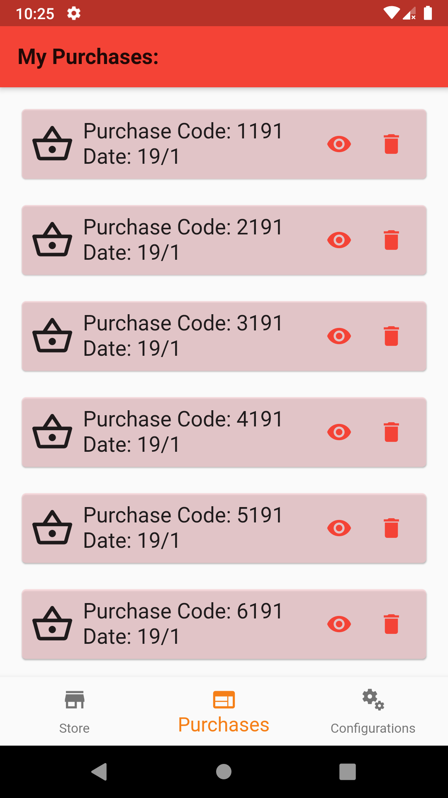

# boockando_app

Um app Flutter de uma loja virtual de livros, onde os seus dados são consumidos de uma API-REST mocada com json-server. A aplicação faz o cache de todos dos principais procedimentos para um uso intuitivo da aplicação offline, e mostra também um feedback de quando o usuário tenta fazer uma operação que não é permitida off-line.

## Get Started
Observações importantes para execução do app:

1. Depois de instalar o json-server (https://www.npmjs.com/package/json-server), para executar o aplicativo corretamente, o usuário deve estabeleçer conexão com o json server, executando o seguinte comando no terminal:

json-server --watch booksOfBoockando.json

Obs.: Você deve estar no caminho do arquivo para executar o comando. [booksOfBoockando.json](repositories/json_server/livros.json)).

2. A constante [URL_SERVER](data/online/consts/consts.dart) está configurada para o uso pelo emulador Android (emulador AVD - (http://10.0.2.2:3000/').  Caso você queira executar de um smartphone, utilize o valor: '(http://ip.do.seu.dispositivo:3000/)'.

## Features

- Splash Screen
- Feedbacks nas operações que não são permitidas enquanto offline
- Catálogo de produtos com filtro de categorias
- Validações nos campos de cadastros e Logins
- Cache das operações: (Utilizando SQLite e Shared Preferences)
  - Cesta de compras
  - Catálogo de produtos
  - Histórico de compras
  - Configurações de tema e tamanho de fonte
  - Usuário que está logado no sistema
- Notificações nas operações de Sign in, Finalização de uma compra, Logout
- Temas (System, Light Theme, Dark Theme, High Contrast)
- Font Size
- Animações (Stack)
- Teste unitário na cesta de compras

## Screenshots
Home Page                  |  Histórico de compras
:-------------------------:|:-------------------------:
||

Feedbacks de conexão       |  Configurações de personalização
:-------------------------:|:-------------------------:
||

Tema - Dark Theme          |  Tema - Alto Contraste
:-------------------------:|:-------------------------:
||

## Modelo Relacional
Modelo relacional utilizado para o Banco de Dados (SQLite).

## Especificações de versões
Flutter: 1.22.4
Android SDK: Androsion 30.0.3
Node.js: v14.15.3

## Equipe desenvolvedora
2. Antônio Honorato Moreira Guedes (Mentorado).
3. Israel Hudson Aragão Barbosa (Mentor).
